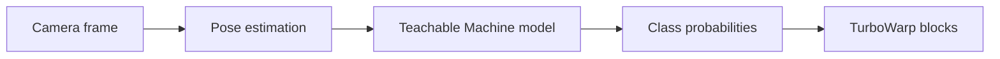

# TurboWarp TMPose

Use a [Teachable Machine Pose](https://teachablemachine.withgoogle.com/train/pose) model as a
camera-based input for TurboWarp projects. TMPose turns each camera frame into pose labels,
confidence scores, and Boolean conditions that Scratch-style scripts can use.

**[Open the illustrated user guide (English)](https://kubohiroya.github.io/turbowarp-tmpose/)** ·
**[日本語ガイド](https://kubohiroya.github.io/turbowarp-tmpose/ja/)** ·
[Block reference](#blocks)

## What TMPose does



- loads a published Teachable Machine Pose model;
- starts and stops the camera independently from recognition;
- places a configurable camera preview over the TurboWarp stage;
- reports the best pose, its confidence, and the confidence of any named pose;
- tests poses with a fixed or custom confidence threshold;
- optionally smooths decisions with time-decayed accumulated scores;
- reports startup timings and explicit runtime errors.

The [illustrated guide](https://kubohiroya.github.io/turbowarp-tmpose/) explains the complete flow,
preview layout, score behavior, privacy, and troubleshooting. English is the default; the
[Japanese version](https://kubohiroya.github.io/turbowarp-tmpose/ja/) has the same content.

## Requirements

- a published Teachable Machine Pose model URL;
- a camera and permission to use it in the browser;
- network access for TensorFlow.js, the Teachable Machine Pose library, and the model files;
- TurboWarp's **Run extension without sandbox** option.

> [!IMPORTANT]
> TMPose is an unsandboxed extension because it needs camera and stage access. Only load extension
> code you trust. Camera APIs also require a secure browser context such as HTTPS or localhost.

## Installation

Download [`dist/tmpose.js`](dist/tmpose.js), then load it from TurboWarp's custom extension dialog
with **Run extension without sandbox** enabled.

The browser-ready, version-pinned build is also available from jsDelivr:

```text
https://cdn.jsdelivr.net/npm/@kubohiroya/turbowarp-tmpose@1.5.1/dist/tmpose.js
```

To add the published package to another project:

```sh
pnpm add --save-exact @kubohiroya/turbowarp-tmpose@1.5.1
```

### Composition API

Composite runtimes can import `@kubohiroya/turbowarp-tmpose/composition` without registering the
Standalone extension or adding blocks. The caller supplies an already-bundled Teachable Machine
Pose runtime and validated model bytes, so this path does not download runtime scripts or model
files.

```js
import {createTMPoseComposition} from '@kubohiroya/turbowarp-tmpose/composition';

const pose = createTMPoseComposition({runtime: bundledTMPoseRuntime});
await pose.registerPoseModel({
  name: 'RescuePose',
  files: [
    {path: 'model.json', bytes: modelBytes},
    {path: 'weights.bin', bytes: weightsBytes},
    {path: 'metadata.json', bytes: metadataBytes},
  ],
});
pose.activatePoseModel('RescuePose');
pose.setPreviewMirroring('unmirrored');
pose.configureAccumulatedPose({
  accumulationPerSecond: 1,
  decayPerSecond: 0.9,
  scoreThreshold: 0,
});
const unsubscribe = pose.subscribeAccumulatedPose((event) => {
  // event.poseName is the one currently selected candidate, or an empty string.
});
await pose.startRecognition();
```

Each composition owns its model registry, active model, camera, and recognition state. Release one
model with `releasePoseModel(name)` or release the complete instance with `releaseAll()`. Calling
`releaseAll()` also removes accumulated-pose listeners. `subscribeAccumulatedPose()` returns an
idempotent unsubscribe function.

`setPreviewMirroring('mirrored' | 'unmirrored')` changes only the camera preview. It can be called
before camera startup, while the camera is running, or after it has stopped. The default remains
`mirrored`, and the recognition input keeps the Teachable Machine runtime's existing horizontal
flip regardless of the preview setting.

Teachable Machine Pose 0.8.3 exposes the classifier as `CustomPoseNet.model` and PoseNet as
`CustomPoseNet.posenetModel`, while its top-level `dispose()` releases PoseNet only. The composition
therefore disconnects an active model from recognition first and disposes those two public
resources separately and exactly once; it does not call the incomplete top-level disposer for this
official shape. A custom injected runtime without those fields can retain the legacy single
top-level `dispose()` contract. A runtime that exposes only part of the official shape is rejected
with `TMPOSE-COMPOSITION-009`, after every safely identifiable resource has been attempted.

Model, weights, and metadata `File` objects exist only for the pending `loadFromFiles()` call and
are not stored in the named registry. `releasePoseModel()` and `releaseAll()` invalidate and wait for
matching pending registrations, so their promises do not resolve before a late loaded model has
been disposed. Switching to an already prepared model after stopping recognition keeps the camera
stream alive; releasing the old, no-longer-active model does not request camera permission again.
Releasing the current model with no prepared successor stops recognition and the camera.

The accumulated-pose API chooses one candidate for an async-input consumer. It is deliberately
separate from an Actor action that waits for multiple pose steps in sequence: a sequence consumer
should read `confidenceOf(name)` and own its per-step progress instead of using or resetting this
candidate-selection state.

Accumulated scores use elapsed wall-clock seconds, not prediction counts:

```text
nextScore = previousScore * decayPerSecond^elapsedSeconds
          + confidence * accumulationPerSecond * elapsedSeconds
```

`accumulationPerSecond` is a finite number greater than or equal to zero. `decayPerSecond` is the
finite fraction retained per second from zero through one; a changed decay takes effect in the next
recognition session. `scoreThreshold` is a finite number greater than or equal to zero. An event is
published only when the selected pose name changes, including one transition to an empty name on
reset or stop; score-only changes do not publish another event. The Standalone extension keeps its
temporal-scoring and event feature flags off by default.

## Quick start

1. Train pose classes such as `jump` and `stand` in Teachable Machine.
2. Export the model, upload it, and copy the model folder URL.
3. Set that URL with `set model URL to [URL]`.
4. Run `start recognition`, allow camera access, and use a result block in your script.

```text
when green flag clicked
set model URL to [https://teachablemachine.withgoogle.com/models/.../]
start recognition

forever
  if <pose is [jump] with confidence at least [0.75]?> then
    ...
  end
end
```

`start recognition` starts the camera and loads the configured model when necessary. A separate
`start camera` or `load model` step is only needed when a project wants to control startup phases
individually.

## Reading recognition results

| Block | Result |
|---|---|
| `current pose` | Class with the highest probability in the latest frame |
| `confidence` | Current pose probability, rounded to two decimal places |
| `confidence of [NAME]` | Probability of one named class |
| `pose is [NAME]?` | Whether the named class has at least `0.75` confidence |
| `pose is [NAME] with confidence at least [THRESHOLD]?` | Same test with a custom `0`–`1` threshold |

Live confidence reacts quickly and can fluctuate near a decision boundary. Better training data,
lighting, camera framing, and a suitable threshold usually improve the result.

## Camera selection, preview, and stopping

Use `refresh camera list` to detect video inputs, then choose `default camera`, `front camera`,
`back camera`, or a detected device with `set camera to [CAMERA]`. Camera labels may be unavailable
until the browser grants camera permission. Device IDs are browser- and machine-specific, so use
the portable front/back choices when a project moves between devices. Changing the selection while
the camera is running restarts only the camera stream, preserving the loaded model, recognition
state, and preview settings. If switching fails, TMPose attempts to restore the previous camera and
records the error in `last error`.

`camera count` reports the latest refreshed count. `camera device ID` and `camera device name`
report the active input when the browser provides those values.

The preview is a camera canvas placed over the TurboWarp stage. It can be shown, hidden, moved to
six stage positions, made transparent, or expanded to fill the stage. Hiding the preview does not
stop recognition. The preview is mirrored by default. Use `set camera preview to [MIRRORING]` to
switch between `mirrored` and `unmirrored`, including while the camera is running. This display-only
setting does not change the frames used for recognition. The `camera preview mirroring` reporter
returns the current setting.

- `stop recognition` clears current results but leaves the camera available;
- `stop camera` also stops recognition, releases the camera tracks, and removes the preview.

TMPose performs pose estimation and classification in the browser and does not upload camera
frames. It does fetch its runtime libraries and the published model. Stop the camera when the
project no longer needs it.

## Optional accumulated pose scoring

The `temporalPoseScoring` feature flag is **off by default**. Builds that enable it can combine
evidence over time for poses that should be held steadily:

```text
previous × decay^elapsedSeconds + probability × accumulation × elapsedSeconds
```

The accumulation coefficient is a per-second rate. The decay coefficient is the fraction retained
after one second and is clamped to `0`–`1`; changes to decay take effect the next time recognition
starts. Accumulation and decay both pause while the document is hidden.

`accumulated pose` returns the highest positive accumulated pose only when it meets the configured
threshold, or an empty string otherwise. The accumulated score reporters continue to return their
unrounded values below that threshold. Resetting or stopping recognition clears all accumulated
scores.

### Accumulated pose change events

The `accumulatedPoseEvents` feature flag is also **off by default** and requires
`temporalPoseScoring`. When both are enabled, other unsandboxed extensions can check
`runtime.ext_tmpose.supportsAccumulatedPoseEvents()` and subscribe to
`TMPOSE_ACCUMULATED_POSE_CHANGED` on the TurboWarp runtime.

Each version 1 event includes `poseName`, `previousPoseName`, `score`, `reason` (`prediction`,
`reset`, or `stop`), and a monotonic `timestamp`. Score-only updates do not emit an event.

## Troubleshooting

Read `last error` first when setup fails. Common causes are denied camera permission, a model editor
URL instead of the published model folder URL, blocked network requests, or loading TMPose in the
sandbox. See the illustrated guide's [troubleshooting section](https://kubohiroya.github.io/turbowarp-tmpose/#troubleshooting)
or [Japanese troubleshooting section](https://kubohiroya.github.io/turbowarp-tmpose/ja/#troubleshooting)
for step-by-step checks.

## Blocks

<!-- BEGIN GENERATED BLOCKS -->

### `TMPose version`

Returns the extension version.

| Property | Value |
|---|---|
| Type | REPORTER |
| Opcode | `versionReporter` |

### `set model URL to [URL]`

Sets the Teachable Machine Pose model URL.

| Property | Value |
|---|---|
| Type | COMMAND |
| Opcode | `setModelURL` |
| `URL` | STRING, default: `https://teachablemachine.withgoogle.com/models/XXXX/` |

### `start camera`

Starts the camera and attaches the preview.

| Property | Value |
|---|---|
| Type | COMMAND |
| Opcode | `startCamera` |

### `stop camera`

Stops the camera and prediction loop.

| Property | Value |
|---|---|
| Type | COMMAND |
| Opcode | `stopCamera` |

### `camera is running?`

Reports whether the camera is running.

| Property | Value |
|---|---|
| Type | BOOLEAN |
| Opcode | `isCameraRunning` |

### `refresh camera list`

Refreshes the list of available video input devices.

| Property | Value |
|---|---|
| Type | COMMAND |
| Opcode | `refreshCameraList` |

### `set camera to [CAMERA]`

Selects the default, front, back, or a detected camera and switches a running camera.

| Property | Value |
|---|---|
| Type | COMMAND |
| Opcode | `setCameraSelection` |
| `CAMERA` | STRING, default: `default`, menu: `cameraMenu` |

### `camera count`

Returns the number of video input devices found by the latest refresh.

| Property | Value |
|---|---|
| Type | REPORTER |
| Opcode | `cameraCountReporter` |

### `camera device ID`

Returns the active camera device ID when available.

| Property | Value |
|---|---|
| Type | REPORTER |
| Opcode | `cameraDeviceIdReporter` |

### `camera device name`

Returns the active camera device name when available.

| Property | Value |
|---|---|
| Type | REPORTER |
| Opcode | `cameraDeviceNameReporter` |

### `show camera preview`

Shows the camera preview.

| Property | Value |
|---|---|
| Type | COMMAND |
| Opcode | `showPreview` |

### `hide camera preview`

Hides the camera preview.

| Property | Value |
|---|---|
| Type | COMMAND |
| Opcode | `hidePreview` |

### `camera preview is visible?`

Reports whether the preview is configured as visible.

| Property | Value |
|---|---|
| Type | BOOLEAN |
| Opcode | `isPreviewVisible` |

### `set camera preview opacity to [OPACITY]`

Sets preview opacity from 0 to 1.

| Property | Value |
|---|---|
| Type | COMMAND |
| Opcode | `setPreviewOpacity` |
| `OPACITY` | NUMBER, default: `0.6` |

### `set camera preview position to [POSITION]`

Sets the preview position on the stage.

| Property | Value |
|---|---|
| Type | COMMAND |
| Opcode | `setPreviewPosition` |
| `POSITION` | STRING, default: `bottom-right`, menu: `positionMenu` |

### `set camera preview to [MIRRORING]`

Sets whether the preview is mirrored without changing the recognition input.

| Property | Value |
|---|---|
| Type | COMMAND |
| Opcode | `setPreviewMirroring` |
| `MIRRORING` | STRING, default: `mirrored`, menu: `previewMirroringMenu` |

### `camera preview mirroring`

Returns mirrored or unmirrored for the current preview setting.

| Property | Value |
|---|---|
| Type | REPORTER |
| Opcode | `previewMirroringReporter` |

### `load model`

Loads the configured pose model.

| Property | Value |
|---|---|
| Type | COMMAND |
| Opcode | `loadModel` |

### `model is loaded?`

Reports whether the model is loaded.

| Property | Value |
|---|---|
| Type | BOOLEAN |
| Opcode | `isModelLoaded` |

### `start recognition`

Starts pose recognition.

| Property | Value |
|---|---|
| Type | COMMAND |
| Opcode | `startPredict` |

### `stop recognition`

Stops pose recognition.

| Property | Value |
|---|---|
| Type | COMMAND |
| Opcode | `stopPredict` |

### `recognition is running?`

Reports whether recognition is running.

| Property | Value |
|---|---|
| Type | BOOLEAN |
| Opcode | `isPredicting` |

### `current pose`

Returns the highest-scoring pose label.

| Property | Value |
|---|---|
| Type | REPORTER |
| Opcode | `currentPoseReporter` |

### `confidence`

Returns the confidence of the current pose.

| Property | Value |
|---|---|
| Type | REPORTER |
| Opcode | `scoreReporter` |

### `confidence of [NAME]`

Returns the confidence for a named pose.

| Property | Value |
|---|---|
| Type | REPORTER |
| Opcode | `poseScoreReporter` |
| `NAME` | STRING, default: `jump` |

### `set accumulated pose accumulation [ACCUMULATION] decay [DECAY]`

Sets the accumulation rate per second and the decay retained per second; decay changes apply to the next recognition session.

| Property | Value |
|---|---|
| Type | COMMAND |
| Opcode | `setAccumulatedPoseParameters` |
| Feature flag | `temporalPoseScoring` |
| `ACCUMULATION` | NUMBER, default: `1` |
| `DECAY` | NUMBER, default: `0.9` |

### `set accumulated pose threshold [THRESHOLD]`

Sets the minimum accumulated score required to report a pose; values below the threshold report an empty string.

| Property | Value |
|---|---|
| Type | COMMAND |
| Opcode | `setAccumulatedPoseThreshold` |
| Feature flag | `temporalPoseScoring` |
| `THRESHOLD` | NUMBER, default: `0` |

### `reset accumulated pose scores`

Clears all accumulated pose scores.

| Property | Value |
|---|---|
| Type | COMMAND |
| Opcode | `resetAccumulatedPose` |
| Feature flag | `temporalPoseScoring` |

### `accumulated pose`

Returns the pose label whose accumulated score is highest and meets the threshold, or an empty string otherwise.

| Property | Value |
|---|---|
| Type | REPORTER |
| Opcode | `accumulatedPoseReporter` |
| Feature flag | `temporalPoseScoring` |

### `accumulated score`

Returns the highest accumulated pose score without rounding.

| Property | Value |
|---|---|
| Type | REPORTER |
| Opcode | `accumulatedScoreReporter` |
| Feature flag | `temporalPoseScoring` |

### `accumulated score of [NAME]`

Returns the accumulated score for a named pose without rounding.

| Property | Value |
|---|---|
| Type | REPORTER |
| Opcode | `accumulatedPoseScoreReporter` |
| Feature flag | `temporalPoseScoring` |
| `NAME` | STRING, default: `jump` |

### `pose is [NAME]?`

Reports whether the named pose has at least 0.75 confidence.

| Property | Value |
|---|---|
| Type | BOOLEAN |
| Opcode | `isPose` |
| `NAME` | STRING, default: `jump` |

### `pose is [NAME] with confidence at least [THRESHOLD]?`

Reports whether the named pose meets the given threshold.

| Property | Value |
|---|---|
| Type | BOOLEAN |
| Opcode | `isPoseWithThreshold` |
| `NAME` | STRING, default: `jump` |
| `THRESHOLD` | NUMBER, default: `0.75` |

### `camera startup time (ms)`

Returns camera startup time in milliseconds.

| Property | Value |
|---|---|
| Type | REPORTER |
| Opcode | `cameraMsReporter` |

### `model load time (ms)`

Returns model load time in milliseconds.

| Property | Value |
|---|---|
| Type | REPORTER |
| Opcode | `modelLoadMsReporter` |

### `first recognition time (ms)`

Returns first prediction time in milliseconds.

| Property | Value |
|---|---|
| Type | REPORTER |
| Opcode | `firstPredictMsReporter` |

### `last error`

Returns the latest recorded error message.

| Property | Value |
|---|---|
| Type | REPORTER |
| Opcode | `lastErrorReporter` |

<!-- END GENERATED BLOCKS -->

## Development

```bash
corepack enable
pnpm install --frozen-lockfile
pnpm check
```

The check runs type checking, tests, the production build, generated-documentation validation,
Pages link validation, distribution reproducibility, and an npm package dry run. The build produces
`dist/tmpose.js`.

## External libraries

The extension currently loads TensorFlow.js 1.3.1 and Teachable Machine Pose 0.8.3 from jsDelivr at runtime.

## License

MPL-2.0
